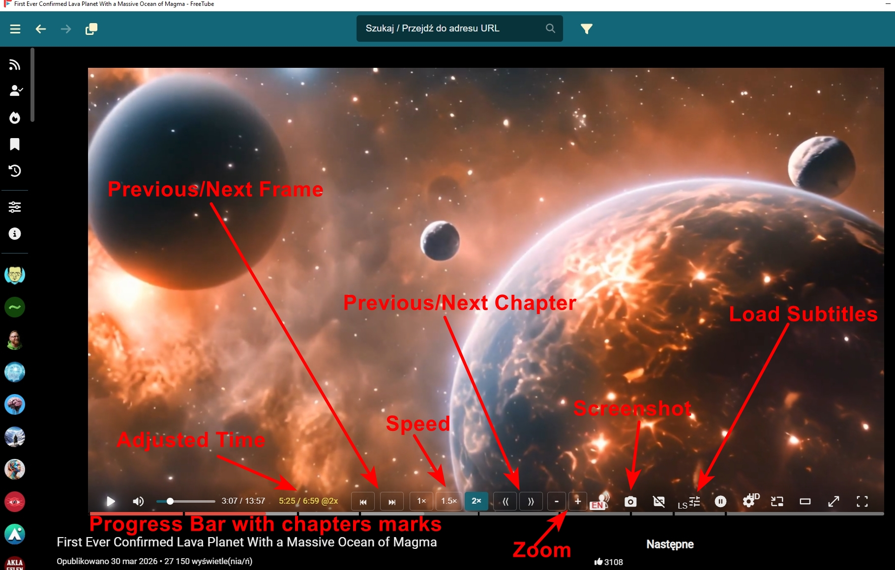

# FreeTubeMOD

 
 
 

18.03.2026 FreeTube 0.23.15-beta.MOD FIX added, 

Fixed an issue where subtitles would turn off if the movie's language matched the system language.

18.03.2026 fix avaiable in orginal version 0.23.15-beta I need fix my version.
 
 
11.03.2026 NO FIX NOW
Several videos are loading, but most of them show an error:

"No audio formats available"
[UNPLAYABLE] Video unavailable.
The page needs to be reloaded.

09.03.2026 FreeTube 0.23.14-beta.MOD.exe
Fixed playback bug (the solution may stop working at any time due to constant changes in the YT algorithm).

Added:
-remembering watched videos (if play was pressed)

-remembering the position of the video being watched

Both options MUST be enabled in the settings.

Privacy-Remember history (choice of 1, 7, 30, 90 days)

Save playback progress (choice of 3 modes)

---

05.03.2026 Youtube change settings AGAIN. MOD STOP working-F*ck

Info from original freetube:

"Thank you for making us aware of this issue.

All videos are currently failing and return the Local API error [object Object]

Our team is actively investigating and will provide updates as they become available."
Original Freetube avaible v0.23.14-beta This workaround is just a temporary fix and could stop working at any point in time.

I waiting for stable version to fix my MOD.

***
FreeTubeMOD 0.23.13 (BAD IP fixed, Livestream error fixed but switching audiotracks STOP working)

29.01.2026 Bad IP Error-I must upgreade program again.
***

DOWNLOAD exe: https://github.com/marek7400/FreeTubeMOD23/releases/tag/FreeTubeMOD23

DOWNLOAD code: https://github.com/marek7400/FreeTubeMOD23/blob/main/FreeTubeMOD23.12-source_code.zip

Virustotal Analysis:
https://www.virustotal.com/gui/file/4c3b60ace0686740cf9c6de2beaa77c4c6d5c185b0071165f1f66adcbb7dfb88?nocache=1

Since no one wanted to add certain features to FreeTube or fix it, I decided to do it myself.
With the help of AI, after a few weeks of struggle, I managed to put something together.

FreetubeMOD23.12 changes:

-addition of a configurable progress bar 
(with chapter markers and movie thumbnails)

-added a recalculated time counter when speeding up the video 
(remaining time/total time@speed)

-added forward/backward frame jump icons

-added buttons for quick speed change: 1x 1.5x 2x

-addition of chapter skip forward/backward icons

-addition of the ability to load custom subtitles

-fixing the display of subtitles as 1-line subtitles

-configurable subtitles (including separate settings for full screen)

-when hovering over the control bar, the controls and mouse pointer do not disappear

-when the “Load with subtitles by default” option is enabled, subtitles are automatically disabled if the movie has audio in the same language as the system language

-disabling automatic translation of movie titles into English in the “Subscriptions” tab

-ability to switch audio tracks to other languages if available 
(requires downloading and entering the track into the yt-dlp.exe file)

Errors: Live stream BAD IP problem.

**************************************************************************************************
Jako, że nikt nie chciał dodać pewnych rzeczy do FreeTube lub naprawić postanowiłem zrobić to sam.
Dzięki pomocy AI po kilku tygodniach walki udało się coś sklecić.

FreetubeMOD zmiany:

18.03.2026 Dodano poprawkę FreeTube 0.23.15-beta.MOD, 

Naprawiono błąd, w wyniku którego napisy wyłączano się, jeśli język filmu był zgodny z językiem systemu.

09.03.2026 FreeTube 0.23.14-beta.MOD.exe
Naprawiono błąd odtwarzania (rozwiązanie w każdej chwili może przestać działać z powodu ciągłych zmian algorytmu YT).

Dodano:
-zapamiętywanie oglądanych filmów (jeżeli wciśnięto play) 

-zapamiętywanie pozycji oglądanego filmu

Obie opcje TRZEBA włączyć w ustawieniach.

Prywatność-Pamiętaj historię (wybór 1, 7, 30, 90 dni)

Zapisuj postęp odtwarzania (wybór 3 trybów)

---

-dodanie konfigurowalnego paska postępu 
(ze znacznikami rozdziałów i miniaturkami filmu)

-dodanie przeliczonego licznika czasu jeżeli przyspieszamy film 
(pozostały czas/całkowity czas@prędkość)

-dodanie ikon skok klatka w przód/tył

-dodanie przycisków do szybkiej zmiany prędkości: 1x 1,5x 2x

-dodanie ikon skok rozdział w przód/tył

-dodanie możliwości ładowania własnych napisów

-naprawienie wyświetlania napisów jako napisy 1 wierszowe

-konfigurowalne napisy (w tym osobne ustawienia dla full screen)

-po najechaniu na pasek kontrolek nie znikają kontrolki ani wskaźnik myszki

-po włączeniu opcji "Domyślnie ładuj z napisami" napisy wyłączają się automatycznie jeśli film ma audio takie same jak język systemu

-wyłączenie automatycznego tłumaczenia tytułów filmów na angielski w zakładce "Subskrypcje"

-możliwość przełączania ścieżek audio na inne języki jeśli są dostępne 
(konieczne ściągnięcie i wpisanie ścieżki do pliku yt-dlp.exe)

Erors: Live stream BAD IP problem.
